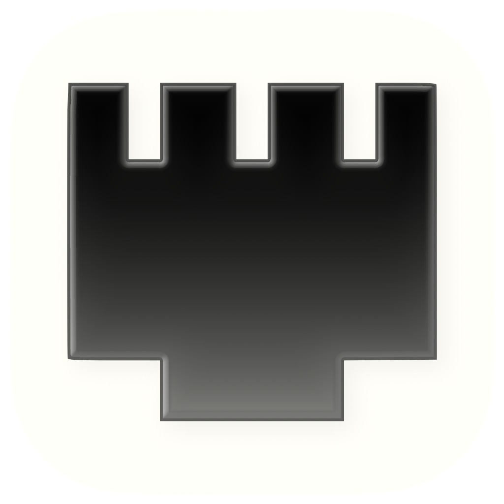

  

  Universal installer at <a href="https://aminerostane.com/sharp">aminerostane.com/sharp</a> or in <a href="../../releases">Releases</a>.

# Sharp

Sharp uses an Ethernet or Thunderbolt cable to turn an older Mac into a display for another Mac. It sends motion as H.264 and restores stable pixels with lossless tiles. The app handles pairing, display mode, cursor, and audio.

## Connect

- **Ethernet:** a direct cable, or both Macs wired to the same switch. Gigabit recommended.
- **Thunderbolt:** any Thunderbolt cable between the Macs; macOS sets up Thunderbolt Bridge. Thunderbolt 1/2 Macs need Apple's Thunderbolt 3 to Thunderbolt 2 adapter.
- **Wi-Fi** is not supported.
- **Firewall:** allow incoming connections for Sharp. Ports: TCP 49171 control (another free port if taken, announced over Bonjour), UDP 49172 display, TCP 49173 audio, Bonjour `_sharp._tcp`.

## Source

| Path | What it contains |
| --- | --- |
| `app/` | SwiftUI app, connection state, discovery, audio, diagnostics, and helper process control |
| `src/core/` | Wire protocol, tile transport, hybrid frame state, packet queues, and framebuffer code |
| `include/sharp/` | Headers for the C core |
| `src/sender/` | Screen capture, virtual display, H.264 encoding, tile scheduling, and network output |
| `src/receiver/` | Network input, H.264 decoding, tile composition, and display presentation |
| `src/platform/` | macOS cursor rendering |
| `resources/` | App icons and cursor assets |
| `tests/` | Focused engine and app-state checks |
| `tools/` | Deterministic scenes for the in-app visual benchmark |
| `scripts/` | DMG layout assets |
| `third_party/` | zstd source and its license |

See [ARCHITECTURE.md](ARCHITECTURE.md) for frame ownership and thread boundaries.

## Build

On macOS with Xcode command-line tools, run `make` for the universal app, `make test` for checks, or `make installer` for the DMG. The sender needs macOS 12.3 or later; system-audio sending needs macOS 14.2 or later. The receiver targets macOS 10.15 or later.
